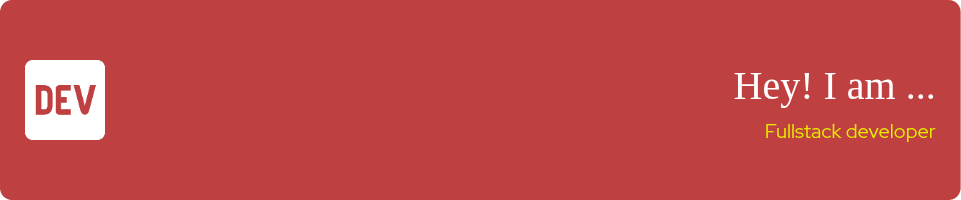

# Ravi Dulundu

[![Website][website-badge]][website-url]
[![LinkedIn][linkedin-badge]][linkedin-url]
[![X][x-badge]][x-url]
![Profile views][views-badge]
[![Docker][docker-badge]][docker-url]
[![Dev Containers][devcontainers-badge]][devcontainers-url]
[![WordPress][wordpress-badge]][wordpress-url]

DevOps-focused engineer building VS Code dev containers and optimized
WordPress experiences.

Based in Brazil • Pronouns: he/him

## Snapshot

- Deliver DevOps-ready TypeScript products with React 19, Next.js 15, Bun, and
  edge runtimes.
- Blend UX research, accessibility, and performance to launch polished
  frontends and WordPress experiences.
- Build tooling such as AI-ready dev containers, CI pipelines, and dashboards
  that keep teams fast and consistent.

## Core Expertise

- **Product Engineering:** React Server Components, Next.js App Router, design
  systems, and data visualisation.
- **Platform & Infrastructure:** Node.js 20/22, Bun, Hono, PostgreSQL,
  WebSockets, Docker Compose, and remote containers.
- **Developer Experience:** Make-based automation, GitHub Actions, and
  AI-assisted workflows with Claude Code, Copilot, Gemini, and Codex.

## Currently Building

- **noob.gg:** matchmaking platform that helps players discover squads. Iterated
  with React 19 and Next.js 15 for real-time discovery.
- **React 19 Exploration:** prototypes for server components and edge-first
  rendering strategies that feed production playbooks.
- **Hono.js + Bun Tools:** scaffolds and deployment scripts for lightweight APIs
  covering Bun, PostgreSQL, and Docker.

## Selected Projects

- **AI Dev Container:** opinionated Docker workspace with VS Code Remote
  integration, four AI CLIs, telemetry dashboards, and 50+ automated checks.
  Standardises environments with Docker Compose, Ubuntu 24.04, and baked-in
  security hardening.  
  [Repository](https://github.com/ravidulundu/claude-dev-container)
- **Glassmorphism Monitoring UI:** responsive dashboard for container metrics,
  real-time charts, and theme-aware visuals.
- **Developer Tooling Playbooks:** internal guides outlining commit conventions,
  review checklists, and release automation.
- **WordPress Delivery:** bespoke themes, performance tuning, SEO, and Core Web
  Vitals monitoring for content-heavy marketing sites.

## Tooling and Stack Highlights

- **Languages and Frameworks:** TypeScript, JavaScript, React 19, Next.js 15,
  Hono.
- **Runtime and Data:** Node.js, Bun, PostgreSQL, Edge Runtime, and WebSockets.
- **DevOps:** Docker, Docker Compose, Ubuntu 24.04, GitHub Actions, and Make.
- **Productivity:** VS Code Remote Containers, fzf, ripgrep, lazygit, Starship,
  and Markdown-first documentation.

## Collaboration Principles

- Lead with structured discovery, then validate solutions with prototypes and
  user feedback.
- Automate linting, testing, and documentation previews before review requests.
- Communicate in short iteration loops with scoped pull requests and actionable
  notes.

## Connect

I am open to conversations about frontend architectures, developer experience
tooling, and remote product delivery.

- Email: reach out via [LinkedIn](https://linkedin.com/in/ravidulundu)
- Portfolio: [ravidulundu.me](https://ravidulundu.me)
- Twitter / X: [@ravidulundu](https://twitter.com/ravidulundu)

If this work resonates, starring the repositories helps others discover them.

[website-badge]: https://img.shields.io/badge/Website-000?logo=firefox
[website-url]: https://ravidulundu.me
[linkedin-badge]: https://img.shields.io/badge/LinkedIn-0A6?logo=linkedin
[linkedin-url]: https://linkedin.com/in/ravidulundu
[x-badge]: https://img.shields.io/badge/X-000000?style=flat&logo=x
[x-url]: https://twitter.com/ravidulundu
[views-badge]: https://komarev.com/ghpvc/?username=ravidulundu
[docker-badge]: https://img.shields.io/badge/Docker-2496ED?logo=docker
[docker-url]: https://www.docker.com
[devcontainers-badge]: https://img.shields.io/badge/Dev%20Containers-0A7
[devcontainers-url]: https://code.visualstudio.com/docs/remote/containers
[wordpress-badge]: https://img.shields.io/badge/WordPress-21759B?logo=wordpress
[wordpress-url]: https://wordpress.org
